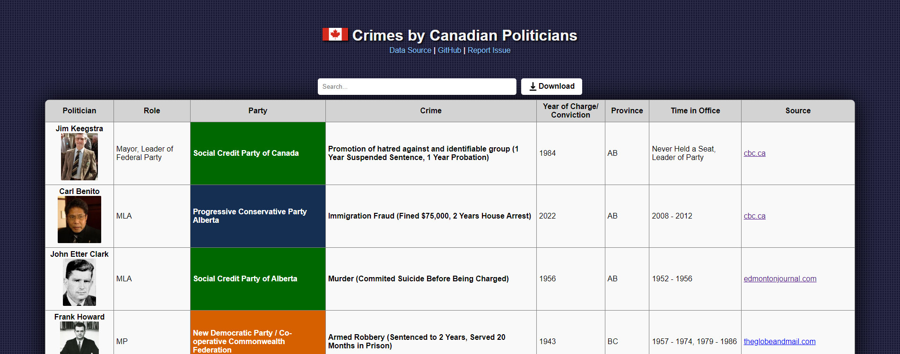

# [Canadian Politician Crimes](https://jeremy-friesen.github.io/canadian-politician-crimes/)



This project is a compilation of data and visualizations about criminal charges and convictions against Canadian politicians. The original data source is a [spreadsheet](https://docs.google.com/spreadsheets/d/1gof45QUi2p0f8YVaKa2fOgtIUBElSueh/htmlview) compiled by [@jonnylegato5 on TikTok](https://www.tiktok.com/@jonnylegato5/video/7430545507333721349). This website is open-source. Find [ways to contribute](#ways-to-contribute) below.


## Features and Future Work

-   [x] Sortable, searchable list of entries
-   [x] Politician pictures
-   [x] Highlight "Time in Office" column when politician is currently in office
-   [x] Download options
    -   [x] CSV
    -   [x] Excel
    -   [x] PDF (optionally with pictures)
    -   [x] Website source files (.zip)
    -   [ ] JSON
    -   [ ] HTML
-   [ ] Charts
    -   [x] Crimes by Party
    -   [x] Crimes by Province or Territory
    -   [ ] Crimes by Type
    -   [ ] Crimes by Political Affiliation or Ideology
    -   [ ] ...
-   [ ] Add an "additions" file/folder (JSON/CSV/etc) for easier data contributions
-   [ ] Visually indicate *charged* or *convicted* status
-   [ ] Handle cases with 2 or more party affiliations
-   [ ] Last-updated date

## Ways to Contribute

#### Anyone

-   [Suggest data additions](https://github.com/jeremy-friesen/canadian-politician-crimes/issues/new) for crimes that aren't added yet.
    -   When possible, please include:
    ```
    name:
    role:
    party:
    crime:
    year of charge/conviction:
    province:
    time in office:
    source:
    ```
-   [Report issues](https://github.com/jeremy-friesen/canadian-politician-crimes/issues/new), such as bugs or incorrect data.
-   [Suggest features](https://github.com/jeremy-friesen/canadian-politician-crimes/issues/new) or enhancements in design, accessibility, etc.
-   Refine data; Check sources, correct details, etc.

#### Programmers/Designers/etc

-   Check the [issues tab](https://github.com/jeremy-friesen/canadian-politician-crimes/issues) for bugs and feature requests.
-   Check [Features and Future Work](#features-and-future-work) for feature ideas.

## Tech

Tools/Languages

-   JavaScript
-   HTML
-   CSS

Hosting

-   This project is made of up of static files and has only client-side code, so hosting is simple.
-   Currently, hosting is done with GitHub pages.

JS Dependencies

-   [pdfmake 0.2.7](https://pdfmake.github.io/docs/0.1/) for generating PDF downloads
-   [chart.js](https://www.chartjs.org/docs/latest/) for making visualizations
-   [SheetJS](https://www.npmjs.com/package/xlsx) for generating excel downloads

Data source formats

-   JSON
    -   [Google Sheet](https://docs.google.com/spreadsheets/d/1gof45QUi2p0f8YVaKa2fOgtIUBElSueh/htmlview)
    -   [party-colours.json](https://github.com/jeremy-friesen/canadian-politician-crimes/blob/main/data/party-colours.json)
-   CSV
    -   [pics.txt](https://github.com/jeremy-friesen/canadian-politician-crimes/blob/main/data/pics.txt)
-   Supported picture formats
    -   JPEG
    -   PNG
    -   AVIF
    -   WEBP

Download formats

-   CSV
-   Excel
-   PDF

## Development

-   `git clone https://github.com/jeremy-friesen/canadian-politician-crimes.git`
-   `cd canadian-politician-crimes`
-   host HTTP file server
    -   with Python: `python3 -m http.server 8000`
    -   with Node.js: `npm install -g http-server`
        -   `http-server -p 8000`
    -   with VS Code "Live Server" extension:
        -   `code .`
        -   Extensions > search "Live Server" > install
        -   click "Live Server" on bottom right
-   in the browser, open `localhost:XXXX`, depending on your port
